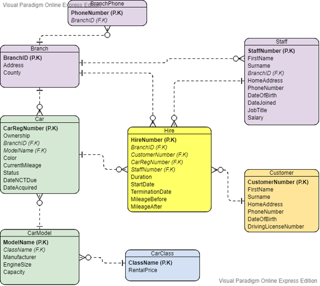
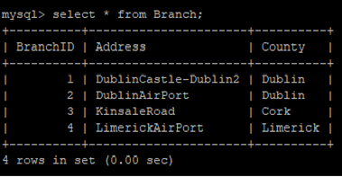
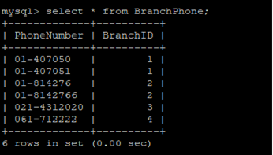
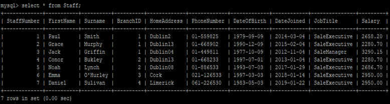
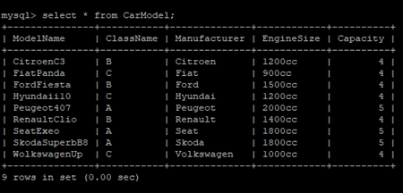
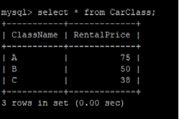
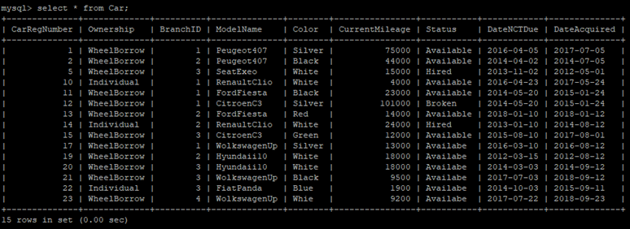
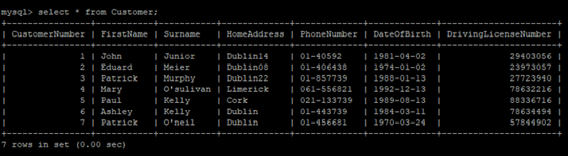
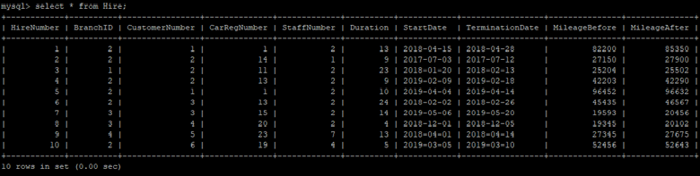

## MySQL-Database-Design-Implementation
---

### Scenario Explanation

WheelBorrow is a car rental company with branches located throughout Ireland. 
Each branch has an id, address and county. Branches can have several phone numbers. 
Each site is allocated a stock of vehicles for hire, 
however, individual vehicles may be moved between branches, as required. 
A vehicle can be assigned to only one branch at a time. 
The registration number uniquely identifies each vehicle for hire and is used when hiring a vehicle to a client. 
Clients may hire vehicles for various periods of time (minimum 1 day to maximum 1 year). 
Each individual hire agreement between a client and the Company is uniquely identified using a hire number. 
Information stored on the vehicles for hire includes: 
The vehicle registration number, model, colour, current mileage, status (available, hired, broken), 
date NCT due, date acquired and which branch it is currently assigned to. 
There can be many cars of the same model. 
Information about each model, includes name of the model, manufacturer, engine size, 
capacity (how many people can fit inside) and which class it belongs to. 
WheelBorrow has three vehicle classes A, B and C. 
Class determines how much customers will pay per day, class A being the most expensive. 
Data stored about each rental consists of which car was rented by which customer, 
which staff member was responsible for the rental as well as date the customer started the rental period, 
date the customer wishes to terminate the rental plus the mileage before and after the rental period. 
The data stored on customers includes the customer number, first name, surname, home address, phone number, 
date of birth, and driving licence number. All customers must have a driving license. 
Information stored about staff includes: staff number, firstname, surname, home address, home phone number, 
date of birth (DoB), date joined the company, job title, and salary. 
Each staff member is associated with a single branch but may be moved to an alternative branch as required, 
although only the current location for each member of staff is stored.

### ER Diagram 
Entity Relationship Diagram is provided in screen shots 

### SQL Statements
SQL statements for creating tables and queris are provided in "WheelBorrow.sql" file 

### Java Database Connectivity (jdbc)
In order to access database through Java, two libraries "jsch-0.1.54" and "mysql-connector-java-8.0.13" are added to java project. 

### Screenshots
| |
|---|
|  | 
|  |
|  |
|  |
|  |
|  |
|  |
|  |
|  |